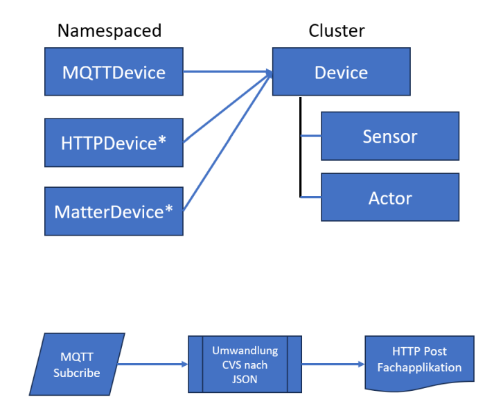

# Industrial Internet of Things

Custom Resources
- - -

Device – IoT Device, z.B. M5StackCore, Atom etc. beinhaltet Sensor und Actor

MQTTDevice empfängt Daten mittels des MQTT-Protokolls. HTTP und Matter Device (* in Planung).

### Custom Resources

Custom Resources erstellen

    git clone https://gitlab.com/ch-mc-b/autoshop-ms/infra/iiot.git
    cd iito
    kubectl apply -f crd
    
Sensoren, Aktoren und Devices erstellen für die [M5Stack](https://m5stack.com/) IoT Geräte    

    kubectl apply -f m5stack/sensors -f m5stack/actors -f m5stack/devices
    
Ausgabe der erstellten Geräte

    kubectl get devices,sensors,actors
    
Details zu einem Sensor

    kubectl describe sensor enviii       
    
**Hinweis**:

Wenn sich die CRD nicht mehr löschen lassen, sind die `finalizers` Einträge zu löschen

    kubectl patch crd mqttdevices.iiot.mc-b.ch --type=merge -p '{"metadata":{"finalizers":[]}}'        

### Operator Pattern, Listener und UI erstellen
    
    cd mqtt-operator
    docker build -t registry.gitlab.com/ch-mc-b/autoshop-ms/infra/iiot/mqtt-operator:1.0.0 .
    docker push registry.gitlab.com/ch-mc-b/autoshop-ms/infra/iiot/mqtt-operator:1.0.0
    cd ..
    
    cd mqtt-listener
    docker build -t registry.gitlab.com/ch-mc-b/autoshop-ms/infra/iiot/mqtt-listener:1.0.3 .
    docker push registry.gitlab.com/ch-mc-b/autoshop-ms/infra/iiot/mqtt-listener:1.0.3
    cd ..
    
    cd mqtt-device-ui
    docker build -t registry.gitlab.com/ch-mc-b/autoshop-ms/infra/iiot/mqtt-device-ui:1.0.0 .
    docker push registry.gitlab.com/ch-mc-b/autoshop-ms/infra/iiot/mqtt-device-ui:1.0.0 
    cd ..
    
**Hinweis**: Umgebungsvariable `DOCKER_HOST=ssh://cna-[KVM-Host]-cp1.maas` setzen um direkt vom lokalen NB die Arbeiten ausführen zu können.

### Operator deployen
    
    kubectl apply  -f mqtt-operator     
    
### Device anlegen

    kubectl apply  -f m5stack/mqtt 
    
Und zum Schluss das UI mit dem Port unter welchem das UI erreichbar ist: 

    kubectl apply  -f mqtt-device-ui    
    kubectl get svc mqtt-device-ui -o jsonpath='{.spec.ports[0].nodePort}' 
    
Das UI beinhaltet Buttons, mit welchem Testnachrichten gesendet werden können. Diese sind in den Logdateien der Devices ersichtlich.

    kubectl logs mqtt-listener-au-u69    
    
und

    kubectl logs mqtt-listener-au-u69a   
    
Zusätzlich werden die Sensorinformationen beim `au-u69` in das Longhorn Filesystem und beim `au-u69a` ins Verzeichnis `/data` geschrieben.     
   
### Aufräumen

Es ist die folgende Reihenfolge einzuhalten!

    kubectl delete -f m5stack/mqtt # --grace-period=0 --force  
    kubectl delete -f mqtt-operator # --grace-period=0 --force 
    kubectl delete -f mqtt-device-ui # --grace-period=0 --force 
    kubectl delete -f m5stack/sensors -f m5stack/actors -f m5stack/devices    
    kubectl delete -f crd
       
    